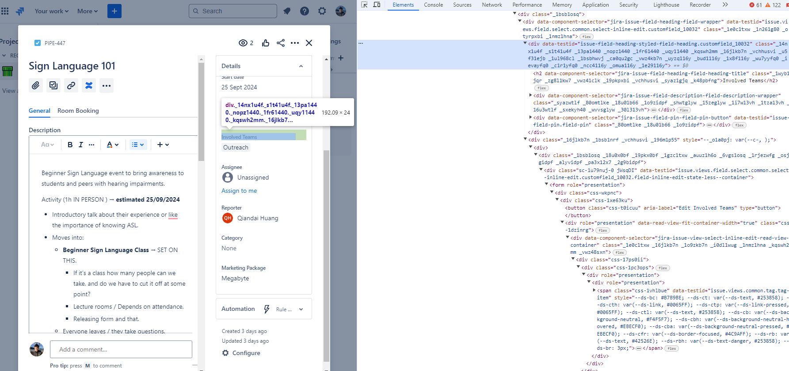
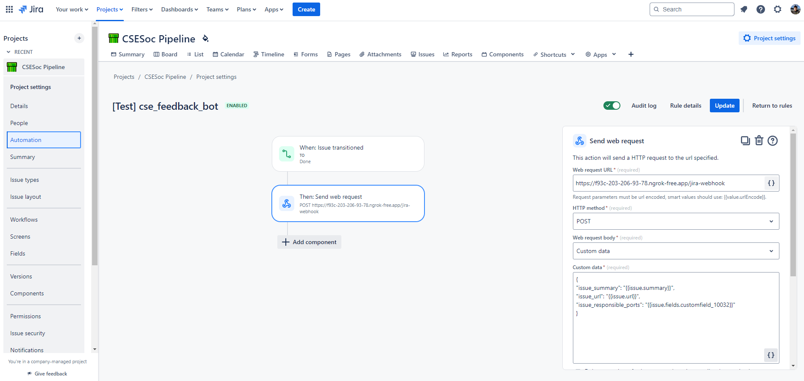

# csesoc_feedback_process_bot
Improve collection of feedback from attendees by reminding CSESoc directors to send out feedback forms.

### What this Bot does
- Reads Feedback Master Sheet to see which Events have had their feedback filled out.
    - It does this by looking at the `Completed` column for the `Feedback Form` column.
- Pings relevant directors/roles on a daily basis until the feedback form is filled out (as per the columns).
    - Retrieving the relevant roles might be a bit difficult, as it is not build in.
        - Either do this by using confluence automation to message the bot in a channel that is only for the bot, and then the bot stores it in a dictionary that maps events to roles. Seems a bit straightforward (we have a script that pings Creative directors automatically) but is clunky.
        - OR: Send a webhook from the jira pipeline to our program (probably a flask server). Clean solution but could introduce more issues due to complexity.
        - OR: Scrape the `pipeline` discord channel. This is way more sus since the titles can be inconsistent in the `pipeline` discord channel.
    - Either way, it will be more difficult to write to the Feedback Spreadsheet using the bot because then we have to use the sheets API, which is a bit overkill. Therefore, it will make more sense to store the relevant channels in the bot. Could potentially also write to a `.json` file.

### Installs on your VM

- The packages will vary, refer to the `main.py` to see what is required.
- I installed with Oracle Cloud, which has a free teir. 
    - I use Bitvise SSH to access the Oracle Cloud system. You will need your private key (from the Oracle Cloud project page) to log into (through ssh) the system.
        - You will only need to upload the necessary files to run to the Oracle Cloud. At the time of writing, I only needed to put up `main.py`, and my `.env`.
    - Oracle Cloud uses python 3.6, you will need to upgrade to python 3.9 to get everything to work (the discord.py library doesn't work with python 3.6).
    - Once you do the install of python 3.9, make sure you install the packages for the python 3.9 verion.

### Running on your VM

- Use `tmux` to make the program keep running while you have the terminal closed.
- `tmux` will make a new `tmux` window thing. When you close the terminal, it will remain running.
    - Inside the `tmux` window, you can run the python script as you normally would. 
        - If you used Oracle Cloud and upgraded to python 3.9, make sure you launch it with the correct version.
- To see the open `tmux` windows, do `tmux ls`. 
- To access a `tmux` window, do `tmux a -t [terminal index]` (eg. `tmux a -t 0`).

### Documentation

- Start the local server with `python3 flask_server.py`.
- Make the local server accessible online with ngrok.

- Retrieving the custom field name



#### Connecting to Confluence Automation

In Confluence Automation, make a new automation rule.

The automation rule should be like this:



**Webhook:** 

Web Request URL:

`https://f93c-203-206-93-78.ngrok-free.app/jira-webhook` (Post Request)

Webhook Contents:

(Select Custom Data)
```
{
"issue_summary": "{{issue.summary}}",
"issue_url": "{{issue.url}}",
"issue_responsible_ports": "{{issue.fields.customfield_10032}}"
}
```

Webhook Header:

```
ngrok-skip-browser-warning: true
```

**The post request we receive:**

```
127.0.0.1 - - [13/Jul/2024 15:59:55] "POST /jira-webhook HTTP/1.1" 200 -
{'issue_summary': 'test2', 'issue_url': 'https://csesoc.atlassian.net/browse/PIPE-452', 'issue_responsible_ports': 'Online, Training Program'}
```

Clean and easy to use!

### TODO:

- Now that we have the post request, we need to store the `issue_responsible_ports` according to the `issue_summary`. We can store this in a `.json` file. Then, when the bot is scheduled to do the ping, we can read from the `.json` and from the sheets, pinging for the events that do not have the feedback filled checked off.