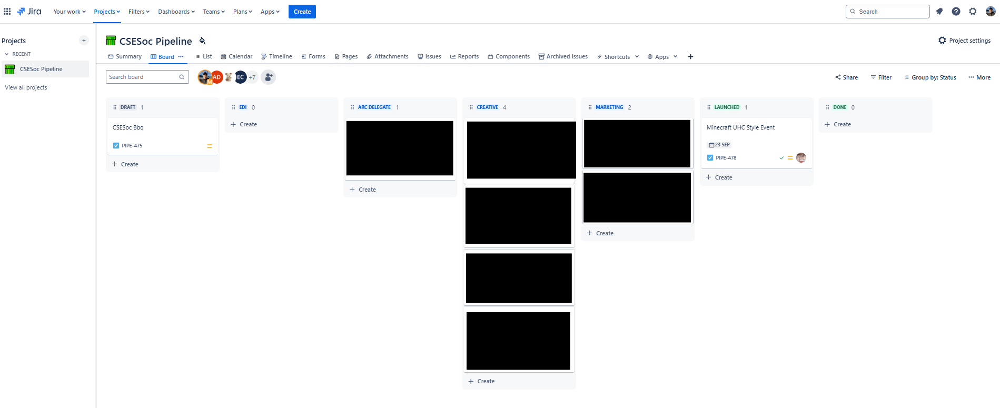
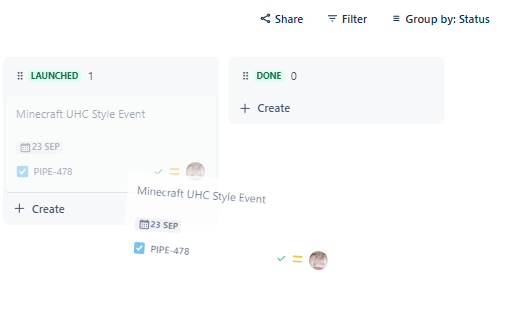
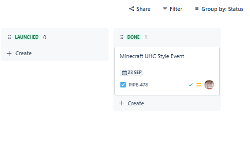
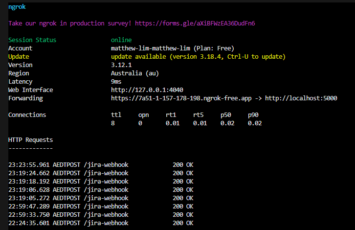
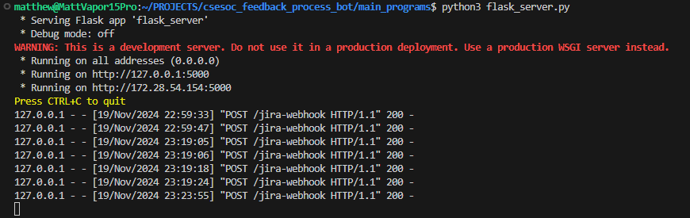
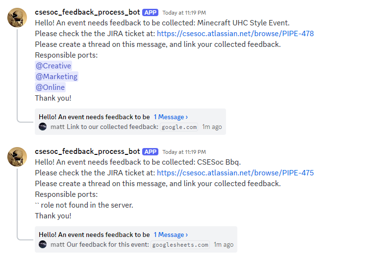

# csesoc_feedback_process_bot
Improve collection of feedback from attendees by reminding CSESoc directors to send out feedback forms.

### Solution Implemented Using Bot
- Sends a webhook from Jira pipeline into our program (using a Flask server with `ngrok` tunneling).
- The bot will ping the relavant roles in a discord channel.
    - I expect that this will be sufficient, since we can introduce a process where relevant Directors or Subcom that were pinged need to start a thread with their feedback collection.
        - This is superior to using the bot to ping on a cycle because it reduces clutter on the channel from duplicate messages. The issue with clutter is twofold: Firstly, people using the channel might be annoyed and mute/ignore it. Secondly, because there would be multiple threads and messages, it would be difficult to keep track of feedback collection.

### Installs on your VM

- The packages will vary, refer to the `main.py` to see what is required.
- I installed with Oracle Cloud, which has a free teir. 
    - I use Bitvise SSH to access the Oracle Cloud system. You will need your private key (from the Oracle Cloud project page) to log into (through ssh) the system.
        - You will only need to upload the necessary files to run to the Oracle Cloud. At the time of writing, I only needed to put up `main.py`, and my `.env`.
    - Oracle Cloud uses python 3.6, you will need to upgrade to python 3.9 to get everything to work (the discord.py library doesn't work with python 3.6).
    - Once you do the install of python 3.9, make sure you install the packages for the python 3.9 verion.
- **UPDATE:** I used the free credit for Azure for Education, which allows for access to much better machinese than the Oracle free teir. I strongly recommend this over using Oracle free teir. That being said, the Oracle free teir VMs will also work. 

### Running on your VM

- Use `tmux` to make the program keep running while you have the terminal closed.
- `tmux` will make a new `tmux` window thing. When you close the terminal, it will remain running.
    - Inside the `tmux` window, you can run the python script as you normally would. 
        - If you used Oracle Cloud and upgraded to python 3.9, make sure you launch it with the correct version.
- To see the open `tmux` windows, do `tmux ls`. 
- To access a `tmux` window, do `tmux a -t [terminal index]` (eg. `tmux a -t 0`).

### Documentation

- Start the local server with `python3 flask_server.py`.
- Make the local server accessible online with ngrok.

- Retrieving the custom field name


#### Connecting to Confluence Automation

Nagivate to your Jira Board. For example, the URL for CSESOC's Jira board is: `https://csesoc.atlassian.net/jira/core/projects/PIPE/board`.

In Confluence Automation, make a new automation rule.

The automation rule should be like this:


The base URL should be the one generated from `ngrok` (recall that `ngrok` is a tunnel between the client and your local flask server, meaning your `ngrok` URL will be different).

**Webhook:** 

The Webhook is what Jira uses to send data to an external service. Here, we use it to send information about the Jira ticket to our Flask server.

Web Request URL:

`https://f93c-203-206-93-78.ngrok-free.app/jira-webhook` (Post Request)

Webhook Contents:

(Select Custom Data)
```
{
"issue_summary": "{{issue.summary}}",
"issue_url": "{{issue.url}}",
"issue_responsible_ports": "{{issue.fields.customfield_10032}}"
}
```

Webhook Header:

```
ngrok-skip-browser-warning: true
```

**The post request we receive in our flask server:**

```
127.0.0.1 - - [13/Jul/2024 15:59:55] "POST /jira-webhook HTTP/1.1" 200 -
{'issue_summary': 'test2', 'issue_url': 'https://csesoc.atlassian.net/browse/PIPE-452', 'issue_responsible_ports': 'Online, Training Program'}
```

Clean and easy to use!

### Example of this bot being used as intended:

- The Jira Pipeline contains all the events.



- Moving the event from `Launched To Done` when the event has taken place already. We now need to collect feedback (which is often forgotten). 
- Our bot will help increase accountability and facilitate easier tracking of feedback for events. In turn, this will enable us to collect more rigorous data and feedback (as well as in more detail as we collect the feedback sooner), ultimately allowing us to improve event quality and better contribute to the CSE community.





- The request goes to `ngrok`.



- `ngrok` tunnels the request to Flask.



- The bot pings the appropriate portfolios daily at a certain time.
    - Note that the edgecase of no assigned portfolios (in Jira) is tested here. In a real scenario, we should not have tickets without assigned portfolios. Nonetheless, this will not interrupt our program.
- Portfolio Directors and Subcommittee now need to create a thread under the event with their collected feedback. They should send the message right when they send out the feedback form.

